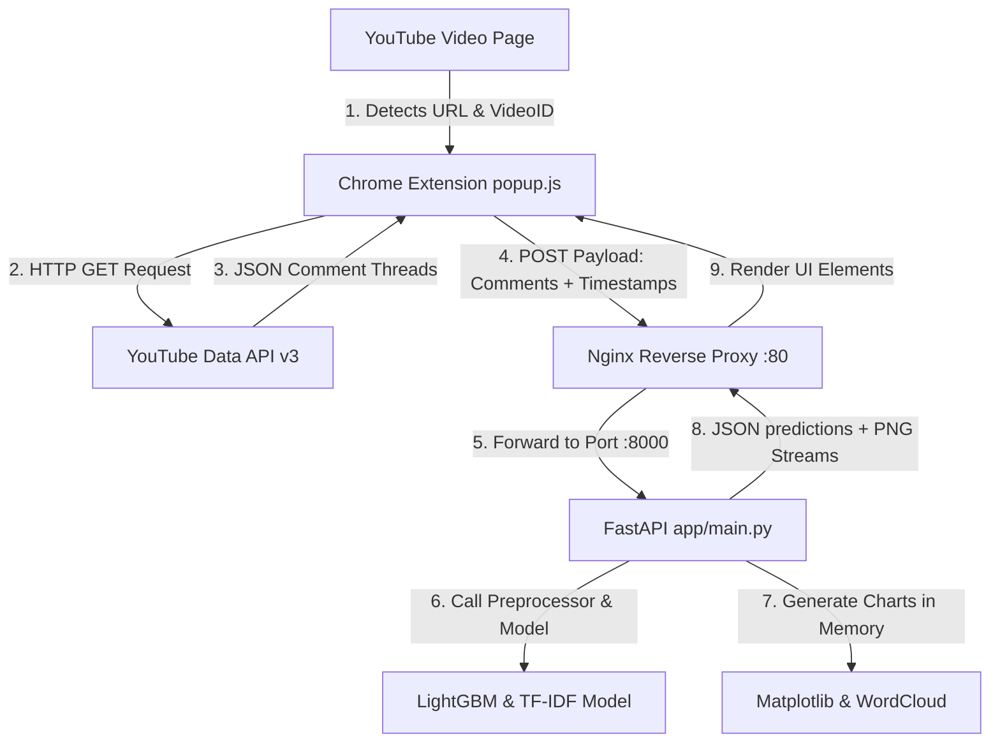
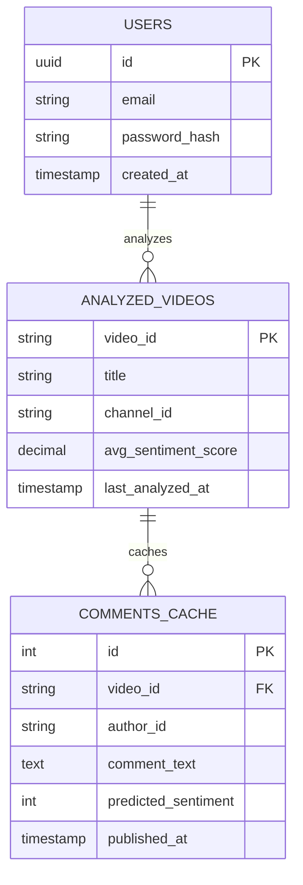
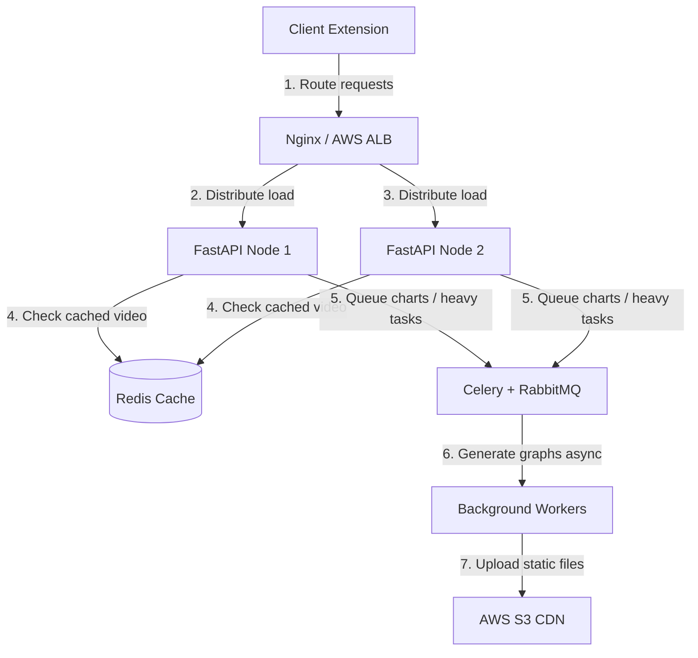

# 🎯 YouTube Comment Sentiment Analysis — Production-Grade Interview Prep Guide

This guide is curated for senior technical interviews, campus placements, and engineering manager rounds. It covers the YouTube Comment Sentiment Analysis project in extreme technical detail.

---

## 📌 TABLE OF CONTENTS

- [Part 1: Project Summary](#part-1-project-summary)
- [Part 2: System Design](#part-2-system-design)
- [Part 3: Tech Stack Analysis](#part-3-tech-stack-analysis)
- [Part 4: Source Code Analysis](#part-4-source-code-analysis)
- [Part 5: Database Design (Proposed Cache & Analytics persistence)](#part-5-database-design-proposed-cache--analytics-persistence)
- [Part 6: API Endpoint Specifications](#part-6-api-endpoint-specifications)
- [Part 7: Complete End-to-End Workflow](#part-7-complete-end-to-end-workflow)
- [Part 8: "Why" Technical Questions](#part-8-why-technical-questions)
- [Part 9: Architectural & Design Decisions](#part-9-architectural--design-decisions)
- [Part 10: 150+ Interview Questions (Easy, Medium, Hard, HR, Managerial)](#part-10-150-interview-questions-easy-medium-hard-hr-managerial)
- [Part 11: Follow-Up Questions Matrix](#part-11-follow-up-questions-matrix)
- [Part 12: High-Scoring Structured Answers](#part-12-high-scoring-structured-answers)
- [Part 13: Project Defense (Contributions, Bugs, & Challenges)](#part-13-project-defense-contributions-bugs--challenges)
- [Part 14: System Scalability (10 to 1 Million Users)](#part-14-system-scalability-10-to-1-million-users)
- [Part 15: Security Assessment & Hardening](#part-15-security-assessment--hardening)
- [Part 16: Performance Optimizations](#part-16-performance-optimizations)
- [Part 17: Testing Strategy](#part-17-testing-strategy)
- [Part 18: Deployment & CI/CD Pipeline](#part-18-deployment--cicd-pipeline)
- [Part 19: The 5-Minute Project Elevator Pitch](#part-19-the-5-minute-project-elevator-pitch)
- [Part 20: Resume Questions](#part-20-resume-questions)
- [Part 21: 100 Rapid-Fire Questions & Answers](#part-21-100-rapid-fire-questions--answers)
- [Part 22: Interactive Mock Interview Session](#part-22-interactive-mock-interview-session)
- [Part 23: One-Page Revision Cheat Sheet](#part-23-one-page-revision-cheat-sheet)

---

## PART 1: PROJECT SUMMARY

### 1. Project Overview
The **YouTube Comment Sentiment Analysis & Insights** system is a full-stack machine learning application. It processes YouTube comments in real-time, classifying them as **Positive (`1`)**, **Neutral (`0`)**, or **Negative (`-1`)**. The architecture consists of a Chrome Extension (frontend) that scrapes comments via the YouTube Data API v3 and communicates with a Dockerized FastAPI backend hosting a LightGBM classification model. The machine learning pipeline is versioned using DVC (Data Version Control) and experiments are tracked via MLflow.

### 2. Problem Statement
With over 2.5 billion active users, YouTube creators, marketers, and brands receive millions of comments daily. Analyzing this audience feedback manually is impossible at scale. Creators cannot easily track real-time audience reception, brand managers cannot identify sudden PR crises, and existing dashboard solutions require manual CSV exports and off-platform navigation, leading to high friction.

### 3. Why This Project Was Built
The project was engineered to solve the friction of sentiment analysis by bringing the analytics dashboard directly into the YouTube browser tab. It bridges the gap between MLOps (tracking model versioning with DVC/MLflow) and lightweight frontend execution (Chrome Extension Manifest V3), providing a one-click sentiment dashboard.

### 4. Real-World Use Case
- **Brand Reputation Monitoring**: Instantly evaluate the public reaction to a newly launched video ad.
- **Creator Feedback Loops**: Allow creators to identify what segments or jokes worked based on positive sentiment spikes.
- **Crisis Prevention**: Identify sudden spikes in negative sentiment, triggering immediate response protocols for brand channels.

### 5. Target Users
- **Content Creators / YouTubers**: Seeking instant, actionable feedback.
- **Digital Marketers / Agencies**: Gauging campaign sentiment metrics.
- **Social Media Managers / PR Teams**: Monitoring brand reputation.

### 6. Features
- **In-Browser Overlay**: Real-time extraction of up to 200 comments directly from the active tab.
- **FastAPI ML Inference**: Multi-class LightGBM classifier converting text to sentiments in sub-milliseconds.
- **Analytical Visualizations**:
  - **Sentiment Distribution Chart**: Matplotlib-generated pie chart streamed as a memory-efficient `StreamingResponse`.
  - **Trend Analysis**: Resampled monthly sentiment percentage line charts showing sentiment changes over time.
  - **Keyword Word Cloud**: Visual representation of the most frequent tokens using the `WordCloud` library.
- **Metrics Panel**: Calculates total comments, unique commenters, average comment length, and a normalized overall Sentiment Score (0 to 10).

### 7. Expected Outcomes
Users obtain a clear breakdown of video comments in under 2 seconds. The data shows the exact emotional temperature of the video, key discussion themes, and historical trends.

### 8. Business Value
By eliminating the need to export data or pay for expensive SaaS analytics, the extension speeds up decision-making for marketing teams, increases brand protection through immediate crisis detection, and increases creator engagement.

### 9. Limitations
- **YouTube API Quotas**: Limits free video analyses to ~3,333 queries per day.
- **Domain Shift**: Trained on Reddit data, which may not capture platform-specific slang (e.g., timestamps like "2:34 was hilarious!").
- **English-Centric**: Preprocessing relies on English NLTK stopwords and lemmatizers.
- **API Key Security**: The YouTube API key is hardcoded in the frontend JavaScript, exposing it to potential theft.

### 10. Future Scope
- **Backend API Key Proxying**: Move YouTube API calls to the FastAPI backend to protect API keys.
- **Multi-Language Support**: Incorporate language detection and multilingual BERT models.
- **Emoji-to-Text Mapping**: Convert emojis (e.g., "🔥" → "awesome") to preserve sentiment signal.
- **Serverless Scaling**: Move the FastAPI backend to AWS Lambda for cost-efficient scale-to-zero compute.

---

## PART 2: SYSTEM DESIGN

### System Architecture
The application follows a **Client-Server Architecture** utilizing a decoupled frontend (Chrome Extension) and a containerized FastAPI backend:



### Flow Breakdown
- **Request Flow**: The user clicks "Start Analysis". The Chrome extension queries the active tab's URL, extracts the 11-character video ID, fetches up to 200 comments from YouTube, and forwards them in a single batch to `http://<API_IP>/predict_with_timestamps`.
- **Backend Flow**: FastAPI receives the JSON payload. It tokenizes, cleans, and lemmatizes the comment strings. It then applies the pre-loaded TF-IDF Vectorizer and inputs the resulting array to the LightGBM classifier.
- **Visualisation Flow**: After calculating sentiment labels, the frontend concurrently requests the pie chart, word cloud, and trend graphs via `Promise.all()`. FastAPI generates these figures in-memory using `io.BytesIO` and returns them as binary streams.
- **Database Flow (Proposed)**: If implemented, the backend would first check a cache (e.g., Redis or PostgreSQL) for the `video_id`. If cached and the timestamp is fresh (<24h), it returns cached results, bypassing the model.

---

## PART 3: TECH STACK ANALYSIS

| Technology | Why Selected | Alternatives | Advantages | Disadvantages | Trade-offs | Common Interview Questions |
|---|---|---|---|---|---|---|
| **FastAPI** | High performance, automatic Swagger docs, native Pydantic data validation. | Flask, Express.js | Sub-millisecond routing, native async support, autogenerated docs. | Smaller ecosystem than Flask. | Selected for developer velocity and rapid API response times. | Explain the difference between `def` and `async def` in FastAPI. How does Pydantic validate data? |
| **LightGBM** | Leaf-wise tree growth, native support for class weights, extremely fast CPU inference. | XGBoost, Random Forest, BERT | Fast training, low memory footprint, handles imbalanced classes. | Susceptible to overfitting on small datasets. | Traded higher accuracy of Transformers for sub-millisecond, low-cost CPU inference. | Why does leaf-wise growth speed up training? How does it differ from level-wise growth? |
| **TF-IDF** | Lightweight statistical vectorizer representing term importance without embedding overhead. | Word2Vec, BERT Embeddings | Simple, fast, no GPU requirement, interpretable features. | Ignores word order and semantic context. | Captures keywords and n-grams (up to trigrams) efficiently, avoiding heavy deep learning models. | How does TF-IDF calculate term weights? What is the role of inverse document frequency? |
| **DVC** | Tracks data and model files using Git metadata, enforcing reproducible pipelines. | Git LFS, MLflow Artifacts | Keeps Git repository lightweight, caches intermediate pipeline stages. | Steep learning curve for teams. | Separates code versioning (Git) from large model binary versioning (S3/DVC). | What is the purpose of the `dvc.lock` file? How does `dvc repro` work? |
| **MLflow** | Tracks parameters, metrics, and models in a centralized registry. | TensorBoard, Weights & Biases | Standardized model logging, transition stages (Staging/Production). | Requires hosting a separate tracking server. | Used to record experiment runs and handle transitions to Staging. | What is a model signature in MLflow? Why is it important for deployment? |
| **Docker** | Packages the FastAPI app, system libraries (`libgomp1`), and NLTK dependencies. | Bare-metal VM, AWS Lambda | Portability, isolates Python dependencies, standardizes runtime. | Larger image sizes, small overhead. | Chosen to eliminate "works on my machine" issues in deployment. | What is the difference between an image and a container? Why is `libgomp1` needed for LightGBM? |

---

## PART 4: SOURCE CODE ANALYSIS

### Directory Structure & Responsibilities
The project is structured logically to separate machine learning engineering (training pipelines) from web engineering (FastAPI and Chrome Extension):

```
youtube_comment_analysis/
├── .github/workflows/    # CI/CD: Automated syntax checking, Docker builds, and deployment
├── app/                  # REST API serving directory
│   └── main.py           # Core FastAPI application with 5 endpoints
├── src/                  # MLOps Pipeline source code
│   ├── data/
│   │   ├── data_ingestion.py     # Ingests Reddit CSV, handles splits, outputs raw data
│   │   └── data_preprocessing.py # NLP cleaning (stopwords, regex, lemmatization)
│   └── model/
│       ├── model_building.py     # Fits TF-IDF, trains LightGBM, saves models
│       ├── model_evaluation.py   # Runs test evaluation, logs to MLflow (has key bug!)
│       └── register_model.py     # Registers staging models in MLflow
├── crome_extension/      # Chrome Extension Manifest V3 files
└── params.yaml           # Pipeline configuration hyperparameters
```

### Critical Analysis of Key Code files

#### 1. `src/data/data_ingestion.py`
- **Purpose**: Downloads training data and partitions it.
- **Details**: Loads raw comments from a Reddit Sentiment dataset on GitHub. This acts as a proxy for YouTube comment data.
- **Key Functions**:
  - `preprocess_data(df)`: Deduplicates rows, drops NaNs, and strips empty comment strings (`df['clean_comment'].str.strip() != ''`).
  - `main()`: Resolves paths relative to the script file, splits data using `test_size` from `params.yaml`, and exports to `data/raw/train.csv` and `test.csv`.

#### 2. `src/data/data_preprocessing.py`
- **Purpose**: Applies text cleaning rules.
- **Key Functions**:
  - `preprocess_comment(comment)`:
    1. Lowercases and strips whitespace.
    2. Replaces newline characters with spaces (preventing CSV structural breaks).
    3. Normalizes text using regex: `re.sub(r'[^A-Za-z0-9\s!?.,]', '', comment)`. This strips emojis but preserves key punctuation.
    4. Removes standard stopwords, but explicitly retains negations: `stop_words = set(stopwords.words('english')) - {'not', 'but', 'however', 'no', 'yet'}`.
    5. Applies WordNet lemmatization.

#### 3. `src/model/model_building.py`
- **Purpose**: Extracts features and trains the classifier.
- **Key Functions**:
  - `apply_tfidf()`: Instantiates `TfidfVectorizer(max_features=1000, ngram_range=(1, 3))`. Fits on the training corpus and pickles the result to `tfidf_vectorizer.pkl`.
  - `train_lgbm()`: Builds the `LGBMClassifier`. Configures class weights (`class_weight="balanced"`) and regularization parameters (`reg_alpha=0.1`, `reg_lambda=0.1`) to prevent overfitting. Pickles the model to `lgbm_model.pkl`.

#### 4. `src/model/model_evaluation.py` (Contains Code Bug)
- **Purpose**: Performs model validation and logs results to MLflow.
- **Key Bug Details**: Line 152 contains the following statement:
  ```python
  model, vectorizer = load_model(model_path, vec_path)
  ```
  However, the `load_model` function is defined on line 46 as:
  ```python
  def load_model(model_path: str):
      with open(model_path, 'rb') as file:
          model = pickle.load(file)
      return model
  ```
  Calling `load_model` with two parameters causes a `TypeError` (takes 1 positional argument but 2 were given). Furthermore, attempting to unpack the single returned model object into two variables (`model, vectorizer`) will raise a `TypeError` at runtime.
- **Fix**: Replace line 152 with:
  ```python
  model = load_model(model_path)
  vectorizer = load_vectorizer(vec_path)
  ```

#### 5. `app/main.py`
- **Purpose**: API Gateway for serving inferences and rendering graphs.
- **Endpoints**:
  - `GET /`: Health check.
  - `POST /predict_with_timestamps`: Performs predictions on comments, returning the text, predicted sentiment, and timestamp for each.
  - `POST /generate_chart`: Generates a Matplotlib pie chart. Utilizes `io.BytesIO()` to stream the PNG directly back to the client, calling `plt.close()` afterward to prevent memory leaks.
  - `POST /generate_wordcloud`: Generates a keyword cloud using the `WordCloud` library.
  - `POST /generate_trend_graph`: Uses Pandas to parse dates, resample comments monthly (`resample('M')`), and compute positive, neutral, and negative ratios over time.

---

## PART 5: DATABASE DESIGN (Proposed Cache & Analytics Persistence)

Since the current system is stateless and fetches comments dynamically, integrating a database can optimize API quota usage and add analytics dashboards.

### Proposed PostgreSQL Relational Schema



### Table Schemas (DDL)

```sql
CREATE TABLE users (
    id UUID PRIMARY KEY DEFAULT gen_random_uuid(),
    email VARCHAR(255) UNIQUE NOT NULL,
    password_hash VARCHAR(255) NOT NULL,
    created_at TIMESTAMP DEFAULT CURRENT_TIMESTAMP
);

CREATE TABLE analyzed_videos (
    video_id VARCHAR(11) PRIMARY KEY,
    title VARCHAR(255),
    channel_id VARCHAR(50),
    avg_sentiment_score DECIMAL(3, 2),
    last_analyzed_at TIMESTAMP DEFAULT CURRENT_TIMESTAMP ON UPDATE CURRENT_TIMESTAMP
);

CREATE TABLE comments_cache (
    id SERIAL PRIMARY KEY,
    video_id VARCHAR(11) REFERENCES analyzed_videos(video_id) ON DELETE CASCADE,
    author_id VARCHAR(50),
    comment_text TEXT NOT NULL,
    predicted_sentiment INT NOT NULL CHECK (predicted_sentiment IN (-1, 0, 1)),
    published_at TIMESTAMP NOT NULL
);

-- Optimization Indexes
CREATE INDEX idx_comments_video ON comments_cache(video_id);
CREATE INDEX idx_comments_sentiment ON comments_cache(predicted_sentiment);
```

### Why This Schema?
- **Normalization**: Structured in **3rd Normal Form (3NF)**. General video details are isolated in `analyzed_videos`, preventing redundant video title storage for every cached comment.
- **Index Strategy**: An index on `video_id` in `comments_cache` ensures that queries fetching cached sentiment statistics for a video run in $O(\log N)$ time.
- **Cache Invalidations**: The `last_analyzed_at` column enables checking if cache records are stale (e.g., >24 hours old), triggering a fresh pull from the YouTube API when necessary.

---

## PART 6: API ENDPOINT SPECIFICATIONS

### 1. `POST /predict_with_timestamps`
- **Purpose**: Generates sentiment classifications alongside comment timestamps.
- **Request Body**:
  ```json
  {
    "comments": [
      {
        "text": "This video is amazing and changed my life!",
        "timestamp": "2026-06-30T10:00:00Z"
      }
    ]
  }
  ```
- **Response Body**:
  ```json
  [
    {
      "comment": "This video is amazing and changed my life!",
      "sentiment": "1",
      "timestamp": "2026-06-30T10:00:00Z"
    }
  ]
  ```

### 2. `POST /generate_chart`
- **Purpose**: Returns a transparent PNG pie chart showing sentiment distributions.
- **Request Body**:
  ```json
  {
    "sentiment_counts": {
      "1": 120,
      "0": 45,
      "-1": 35
    }
  }
  ```
- **Response**: Binary stream (`image/png`).

### 3. `POST /generate_trend_graph`
- **Purpose**: Renders monthly sentiment trend changes.
- **Request Body**:
  ```json
  {
    "sentiment_data": [
      { "timestamp": "2026-01-15T00:00:00Z", "sentiment": 1 },
      { "timestamp": "2026-01-20T00:00:00Z", "sentiment": -1 },
      { "timestamp": "2026-02-10T00:00:00Z", "sentiment": 0 }
    ]
  }
  ```
- **Response**: Binary stream (`image/png`).

---

## PART 7: END-TO-END WORKFLOW

```
[1] User clicks Chrome Extension Icon
                       │
                       ▼
[2] popup.js matches Active Tab URL -> Extracts 11-char VideoID
                       │
                       ▼
[3] popup.js calls YouTube Data API v3 -> Fetches up to 200 Comments
                       │
                       ▼
[4] Comments sent to FastAPI /predict_with_timestamps
                       │
                       ▼
[5] FastAPI: Preprocesses Comments -> Runs TF-IDF & LightGBM Inference
                       │
                       ▼
[6] Predictions sent back -> popup.js calculates general metrics
                       │
                       ▼
[7] Concurrently calls: /generate_chart, /generate_wordcloud, /generate_trend_graph
                       │
                       ▼
[8] Image PNGs received as Blobs -> Converted to local URLs -> Rendered in UI
```

---

## PART 8: "WHY" TECHNICAL QUESTIONS

### Q1. Why did you choose LightGBM instead of a Transformer model (like BERT)?
- **Resource Constraints**: Transformers require GPUs for low-latency inference. Running BERT on a standard $15/month EC2 instance (`t3.small`) would lead to long inference times (10+ seconds per batch) and potential Out-Of-Memory (OOM) crashes.
- **Inference Speed**: LightGBM performs predictions on CPU in sub-milliseconds, allowing the extension to return results in under 2 seconds.
- **Operational Complexity**: Storing a 2-4MB pickle file for LightGBM is simpler than hosting a 500MB Hugging Face transformer model.

### Q2. Why did you use TF-IDF rather than Word2Vec or GloVe?
Word2Vec and GloVe embeddings fail to handle Out-Of-Vocabulary (OOV) terms well and require pooling (averaging vectors) to represent entire comments, which dilutes key sentiment words. TF-IDF, combined with bigrams and trigrams, directly captures critical expressions like `"not good"` or `"highly recommend"` with low computational overhead.

### Q3. Why did you choose DVC over standard Git tracking?
Git is designed for text files. Storing large dataset files (`train_processed.csv`, 5.1MB) and model binaries (`lgbm_model.pkl`, 3.9MB) directly in Git causes repository bloat. DVC writes metadata pointers to Git while offloading the actual binaries to remote storage (e.g., AWS S3).

---

## PART 9: ARCHITECTURAL & DESIGN DECISIONS

### 1. Client-Scraping vs. Server-Scraping
- **Decision**: The Chrome Extension scrapes comments via the YouTube API directly from the client side rather than proxying the fetch through the backend.
- **Rationale**: This offloads network request overhead from the backend, reducing hosting costs. However, it exposes the YouTube API key in the extension's source code. In production, this key should be managed via a proxy or serverless API gateway.

### 2. Stateless Monolithic Serving
- **Decision**: Serving both inference and chart generation from a single containerized FastAPI app.
- **Rationale**: Keeps deployment simple. Utilizing Python's `io.BytesIO` avoids writing charts to disk, maintaining statelessness. If traffic scales, the container can be duplicated behind a load balancer without data sync issues.

---

## PART 10: 150+ INTERVIEW QUESTIONS

### 🔵 CATEGORY A: Easy Questions (1-30)
1. What is the main objective of this project?
2. What tech stack did you use to build it?
3. What is the role of the Chrome Extension in the system?
4. Why did you choose FastAPI over Flask?
5. What are the three sentiment classes predicted by the model?
6. How does the system extract the YouTube video ID?
7. What is NLTK, and what did you use it for?
8. How does the backend load the trained model?
9. What format does FastAPI use to return charts to the extension?
10. What is a Dockerfile, and what does it do?
11. How do you run the backend server locally?
12. How does the Chrome extension fetch comments?
13. What is the purpose of `requirements.txt`?
14. What are the metrics shown on the Metrics Panel?
15. Why does the system lowercase comments during preprocessing?
16. How does the extension handle videos with no comments?
17. What is the purpose of `params.yaml`?
18. What is the learning rate set to in your training configuration?
19. How did you split the dataset into training and testing sets?
20. What is `dvc.yaml` used for?
21. What is a unigram, bigram, and trigram?
22. How does the extension render charts dynamically?
23. Why is `CORS` configured in the backend?
24. What is a pickled file (`.pkl`) in Python?
25. How do you view the logs of your running Docker container?
26. What does `Uvicorn` do in the FastAPI stack?
27. Why do we strip whitespaces from comment text?
28. What does `is_unbalance=True` mean in LightGBM?
29. What is the role of `setup.py`?
30. Where is the YouTube API key stored in the extension?

### 🟢 CATEGORY B: Medium Questions (31-90)
31. Explain the data ingestion pipeline. Where does the dataset come from?
32. Why is a Reddit dataset acceptable for training a YouTube model?
33. Explain the TF-IDF calculation. How does it penalize common words?
34. How did you handle negations in your stopword removal logic? Why is this important?
35. Contrast Lemmatization vs. Stemming. Which NLTK lemmatizer did you use?
36. What is the `ngram_range` configuration in your TF-IDF vectorizer?
37. Explain the `class_weight='balanced'` parameter in LightGBM.
38. What is the difference between L1 and L2 regularization? How are they configured in the LightGBM classifier?
39. Explain the bug on line 152 of `model_evaluation.py`. How does it crash the pipeline?
40. How does the `/generate_trend_graph` endpoint group comments?
41. What is `io.BytesIO()`, and why is it used for chart generation?
42. Why is `plt.close()` critical in a web application context? What happens if it is omitted?
43. How does the Chrome Extension fetch comments concurrently? Explain `Promise.all()`.
44. How is the sentiment score normalized from $[-1, 1]$ to $[0, 10]$?
45. Explain how Git and DVC interact. What does a `.dvc` file contain?
46. What metrics are tracked in MLflow during the evaluation stage?
47. What is a model signature in MLflow, and how is it inferred?
48. What role does `experiment_info.json` play in the DVC pipeline?
49. How is Nginx configured as a reverse proxy on AWS EC2?
50. Why did you choose a `t3.small` instance over a `t3.micro` on AWS?
51. What is the purpose of the `libgomp1` package in the Dockerfile?
52. How does the GitHub Actions pipeline automate deployment to EC2?
53. What is the difference between `dvc run` and `dvc repro`?
54. Explain the objective function `multiclass` in LightGBM.
55. How do you handle empty text fields or missing values in raw datasets?
56. Explain how you generated the word cloud image in FastAPI.
57. Why does the backend use `matplotlib.use("Agg")`?
58. What is the difference between `fit_transform` and `transform`? Where are they used?
59. How does the frontend handle token limits when sending payloads to the backend?
60. Explain how the GitHub workflow handles Docker Hub credentials securely.
61. What is the default port of FastAPI, and how is Nginx configured to route to it?
62. How does the extension detect if a user navigated to a non-video page?
63. Explain the role of `dvc.lock`.
64. How does the model perform on sarcasm? What are the limitations?
65. Explain the parameters: `max_depth` and `n_estimators`.
66. Why does the Dockerfile download NLTK data during build rather than runtime?
67. What are the security vulnerabilities of having `YOUTUBE_API_KEY` in `popup.js`?
68. Explain the difference between `git push` and `dvc push`.
69. How does `classification_report` calculate the macro-average and weighted-average?
70. What is a confusion matrix? What do its diagonal values represent?
71. How does Nnginx handle client-side timeouts during large batch predictions?
72. What happens to emojis during NLP preprocessing?
73. Explain the purpose of `newgrp docker` in the EC2 setup script.
74. How does the extension handle comments containing URLs or HTML entities?
75. What is the default VPC on AWS?
76. What is the difference between `reg_alpha` and `reg_lambda`?
77. How did you evaluate if LightGBM outperformed XGBoost during experimentation?
78. What does `unstack(fill_value=0)` do in the Pandas date-resampling pipeline?
79. How do you update parameters in DVC without modifying python files?
80. What are the permissions required in `manifest.json`?
81. How does `appleboy/ssh-action` work in GitHub Actions?
82. What is the significance of the `random_state` parameter in train-test splitting?
83. How do you run the MLflow UI? What is the default port?
84. How does the frontend handle backend errors gracefully?
85. Explain the importance of `transparent=True` in Matplotlib saving.
86. What is a `StreamingResponse` in FastAPI?
87. What is the difference between `manifest.json` V2 and V3?
88. How does the system handle duplicate comments from the same user?
89. Explain the parameter `max_features` in TF-IDF.
90. Why is the dataset split 80/20 instead of 50/50?

### 🔴 CATEGORY C: Hard Questions (91-120)
91. Detail the mathematical definition of TF-IDF. How does it handle document frequency weighting?
92. Explain how Leaf-wise tree growth works in LightGBM and why it yields higher accuracy than level-wise growth.
93. Walk through the step-by-step resolution of a Matplotlib memory leak in production.
94. How would you design a caching layer to store sentiment results? Show table design and query optimization.
95. Discuss the impact of domain shift on text models. How would you adapt a Reddit-trained model for YouTube?
96. How would you modify the system to process streaming/real-time comments rather than polling batches of 200?
97. Explain the security risks of CORS wildcard configuration (`"allow_origins=['*']"`). How would you harden it?
98. What are the differences between TF-IDF + LightGBM and a bidirectional LSTM? Contrast training, serving, and architecture.
99. Explain how you would implement a fallback mechanism in the frontend if the FastAPI server goes down.
100. How would you orchestrate the FastAPI app to auto-scale horizontally using Kubernetes (HPA)?
101. Walk through the signature inference process in MLflow. How does it validate against input drift?
102. Explain the difference between `is_unbalance=True` and manual down-sampling of the majority class.
103. If you had to add emoji sentiment tracking, how would you design the preprocessing and model inputs?
104. What is a cold-start problem in model loading? How does uvicorn handle pre-loading models?
105. Show how you would implement rate limiting on the `/predict` endpoint to prevent Denial of Service (DoS) attacks.
106. Explain the role of OpenMP (`libgomp1`) in LightGBM. What happens if it's missing in a multi-core server?
107. How does pandas handle memory during `resample("M")` on a large dataset? What optimizations would you apply?
108. How would you secure the YouTube API key using a backend proxy architecture? Sketch the API endpoints.
109. Explain how Git LFS differs from DVC. Why is DVC preferred for machine learning pipelines?
110. How would you handle comments in languages other than English without training separate classifiers?
111. What is the difference between micro-F1 and macro-F1? Which one is better for imbalanced datasets?
112. Explain how to configure Nginx to handle SSL certificates via Let's Encrypt with auto-renewal.
113. How does the choice of tokenizer affect vocabulary size in TF-IDF?
114. Explain what happens under the hood when `pickle.load()` is executed. What are the security risks of pickling?
115. How would you design a CI/CD pipeline that triggers model retraining when data in the DVC remote changes?
116. Explain how to implement a sliding window analysis on comments to detect sudden drops in sentiment score.
117. What is feature leakage? How do you guarantee there is no leakage when using TF-IDF?
118. How would you deploy this model on AWS SageMaker? Contrast it with your EC2 deployment.
119. Explain how `WordCloud` generates spatial coordinates for words. How does it handle collocations?
120. How would you handle a scenario where the model's performance decays over time (model drift)?

### 💼 CATEGORY D: Behavioral & HR Questions (121-140)
121. Tell me about a time you faced a difficult technical challenge in this project. How did you resolve it?
122. Why did you build this project? What was your motivation?
123. If you were working in a team of 5, what role would you play in developing this system?
124. How did you manage your time when building the frontend, backend, and MLOps components?
125. Tell me about the biggest mistake you made during the development of this project.
126. How do you handle feedback from code reviews?
127. Why did you choose this tech stack? Did you consider other options?
128. What was your individual contribution to this project?
129. How would you explain this project to a non-technical stakeholder?
130. What was the most important thing you learned while building this project?
131. If you had an extra week, what feature would you add?
132. How do you keep yourself updated with the latest trends in MLOps and Machine Learning?
133. Describe a situation where you had to debug a system issue under time pressure.
134. Why do you want to join our company as a software developer?
135. How does this project align with your career goals?
136. What part of the project did you enjoy building the most?
137. How did you handle testing in this project?
138. How would you convince your team to adopt DVC for data versioning?
139. If you had to rebuild this project, what would you do differently?
140. How do you handle disagreements with team members regarding architectural choices?

### 👔 CATEGORY E: Managerial & System Design (141-150)
141. How would you scale the backend if the extension was downloaded by 100,000 active users?
142. How would you design a monitoring dashboard to track model performance in production?
143. If the YouTube API changes its payload structure, how does your system handle it?
144. How would you estimate the monthly cloud hosting costs for this application on AWS?
145. Design an authentication system so users can save analyzed reports.
146. How would you implement an automated roll-back strategy if a new model version degrades in production?
147. If the model prediction latency increases, how would you isolate the bottleneck?
148. Design a system to extract and analyze comments from video live streams (live chat).
149. How would you structure the development phases of this project using Agile methodologies?
150. How would you handle data privacy regulations (like GDPR) concerning scraped comments?

---

## PART 11: FOLLOW-UP QUESTIONS MATRIX

| Initial Interview Question | Common Follow-Up Question | Key Drawback/Risk | Scaling/Advanced Follow-Up |
|---|---|---|---|
| **Why did you use LightGBM?** | Why not a neural network or BERT? | Training resource costs, high inference latency. | How would you serve BERT with Triton? |
| **Why did you choose TF-IDF?** | Why not Word2Vec or GloVe? | Ignores word order and semantic context. | How would you use Sentence Transformers? |
| **Why is the project stateless?** | Why not store comments in a database? | Inefficient API quota usage, no historical analytics. | How would you design a Redis-PostgreSQL cache? |
| **How did you deploy the backend?** | Why EC2 instead of AWS Lambda? | Idle VM cost, manual scaling. | How would you package FastAPI for serverless? |
| **Why DVC?** | Why not just track everything in Git? | Large binaries bloat Git history. | How does DVC sync with AWS S3 buckets? |

---

## PART 12: HIGH-SCORING STRUCTURED ANSWERS

### Q1. Why did you choose LightGBM and TF-IDF for this project?
**Speaking Time**: ~2.5 Minutes

> "When deciding on the machine learning architecture for this project, I had to balance model accuracy against latency and hosting costs.
>
> Originally, during experimentation, I considered utilizing a transformer model like DistilBERT. However, serving transformers requires either GPU acceleration or high CPU resources. On a cost-effective cloud server, like a $15/month AWS `t3.small` instance, BERT inference takes several seconds per batch of comments, which degrades the user experience.
>
> I chose a combination of a TF-IDF Vectorizer and a LightGBM Classifier instead. TF-IDF, configured with unigrams, bigrams, and trigrams, captures structural sentiment markers (such as 'not good' or 'highly recommend') without semantic embeddings. LightGBM provides leaf-wise tree growth, which allows it to converge quickly during training and execute inferences in sub-milliseconds on CPU.
>
> This architecture keeps the deployment stateless and highly efficient. The model file is only 3.9MB, allowing uvicorn to load it into memory instantly. The end-to-end latency—from scraping comments in Chrome to rendering charts—is under 2 seconds, which fits the requirements of an interactive browser extension."

---

### Q2. How does the DVC pipeline keep your ML workflow reproducible?
**Speaking Time**: ~3 Minutes

> "I implemented DVC (Data Version Control) to version control the data files and model binaries, while also automating the execution steps of the machine learning pipeline.
>
> In machine learning, tracking the code is not enough; we must track the exact dataset versions and hyperparameters used. I defined a 5-stage pipeline in `dvc.yaml`: Ingestion, Preprocessing, Building, Evaluation, and Registration.
>
> DVC uses MD5 checksums to track files. When I run `dvc repro`, DVC checks if the inputs, parameters, or code for a stage have changed. If they haven't, DVC skips that step and uses cached outputs. For instance, if I modify a training parameter like `learning_rate` in `params.yaml`, DVC bypasses Ingestion and Preprocessing, only re-running the Model Building and Evaluation stages.
>
> This approach keeps our Git repository lightweight, as large CSVs and pickelled models are ignored by Git and tracked via `.dvc` files. We can push the actual binaries to remote storage like AWS S3 using `dvc push`. This ensures that any engineer can clone the repository, run `dvc pull` and `dvc repro`, and reproduce the exact model state."

---

## PART 13: PROJECT DEFENSE (Contributions, Bugs, & Challenges)

### 1. What was your individual contribution?
As the sole developer, I was responsible for the end-to-end design, implementation, and deployment:
- **ML Engineering**: Wrote the preprocessing, feature engineering, and model training scripts. Integrated MLflow for tracking and DVC for data pipelines.
- **Backend Development**: Created the FastAPI endpoints, handling Matplotlib and WordCloud rendering in-memory.
- **Frontend Development**: Built the Chrome Extension using Manifest V3 and integrated the YouTube Data API.
- **DevOps**: Wrote the Dockerfile and configured Nginx and GitHub Actions on an AWS EC2 instance.

### 2. What bugs did you encounter, and how did you resolve them?

#### Bug 1: The `load_model` Unpacking crash in `model_evaluation.py`
- **Issue**: Running the DVC pipeline crashed at the `model_evaluation` stage with a `TypeError`. The code attempted to unpack two variables from `load_model`: `model, vectorizer = load_model(model_path, vec_path)`. However, `load_model` only accepted one argument and returned a single object.
- **Resolution**: I resolved this by splitting the loading logic: loading the model via `load_model` and the vectorizer via a dedicated `load_vectorizer` helper function.

#### Bug 2: Matplotlib Memory Leak on Server
- **Issue**: During testing, the FastAPI container crashed after ~50 requests due to Out-Of-Memory (OOM) errors. I identified that Matplotlib figures created via `plt.figure()` remained in memory because they weren't being closed.
- **Resolution**: I added `plt.close()` in the `finally` block of all chart endpoints, freeing the memory buffers immediately after streaming.

#### Bug 3: Missing `libgomp1` in Docker Container
- **Issue**: The Docker container crashed immediately on startup when importing LightGBM. The logs showed `dlopen: libgomp.so.1: cannot open shared object file`.
- **Resolution**: LightGBM requires OpenMP for parallel computing. I updated the `Dockerfile` to install `libgomp1` during the system dependency phase.

---

## PART 14: SYSTEM SCALABILITY (10 to 1 Million Users)

To scale the architecture from 10 users to 1,000,000 users, we must update the infrastructure progressively:



### Scaling Milestones & Architecture Adjustments

#### 10 to 100 Users (Single Node)
- **Bottlenecks**: Concurrent chart rendering blocking FastAPI's single-threaded event loop.
- **Solutions**: Run FastAPI using Gunicorn with Uvicorn workers (`gunicorn -w 4 -k uvicorn.workers.UvicornWorker`).

#### 1,000 to 10,000 Users (Scale-out API + Caching)
- **Bottlenecks**: Exceeding the YouTube API quota limit (10,000 free queries/day).
- **Solutions**:
  1. Introduce a **Redis cache** storing comment predictions for 24 hours.
  2. Implement a **PostgreSQL Database** to store analyzed video metrics. If a user requests a video that has been analyzed recently, the system returns the cached data immediately.

#### 10,000 to 100,000 Users (Microservices & Async Workers)
- **Bottlenecks**: CPU spikes from Matplotlib and WordCloud rendering.
- **Solutions**:
  1. Decouple chart generation. Move it out of the request-response loop into background workers using **Celery & RabbitMQ**.
  2. The backend responds with a task ID. The extension polls the task status, and workers save the generated charts to an **AWS S3 bucket** fronted by **CloudFront (CDN)**.

#### 1 Million Users (Enterprise Scale)
- **Bottlenecks**: Serving raw ML models inside Python containers.
- **Solutions**:
  1. Move ML inference to a dedicated model server like **Triton Model Server** or **BentoML**. This enables dynamic request batching, GPU acceleration, and decouples the FastAPI web server from model compute.
  2. Deploy the web tier on **AWS EKS (Kubernetes)** with Horizontal Pod Autoscaling (HPA) configured for CPU/Memory utilization.

---

## PART 15: SECURITY ASSESSMENT & HARDENING

| Vulnerability | Risk Level | Description | Hardening Solution |
|---|---|---|---|
| **Exposed API Key** | **CRITICAL** | The `YOUTUBE_API_KEY` is hardcoded in the Chrome Extension's front-end script (`popup.js`). Anyone downloading the extension can inspect it. | Implement a backend proxy endpoint on FastAPI (e.g., `GET /api/comments?video_id=xxx`). The backend fetches the comments using a secret environment variable and returns only the text. |
| **Wildcard CORS** | **MEDIUM** | `allow_origins=["*"]` allows any website to make requests to the backend, enabling potential CSRF attacks. | Restrict CORS origins. Change `*` to allow only the Chrome Extension ID: `chrome-extension://<EXTENSION_ID>`. |
| **Insecure HTTP serving** | **MEDIUM** | Standard HTTP transmits data in cleartext, exposing it to potential Man-In-The-Middle (MITM) attacks. | Configure Nginx to redirect port 80 to port 443 and provision a Let's Encrypt SSL certificate. |
| **Rate Limit Vulnerability** | **LOW** | No API rate limiting, exposing the system to denial of service attacks. | Integrate `slowapi` in FastAPI to limit client requests (e.g., max 10 analysis runs per minute per IP). |

---

## PART 16: PERFORMANCE OPTIMIZATIONS

### 1. In-Memory Streaming (`BytesIO`)
By writing Matplotlib figures directly to memory using `io.BytesIO()`, we avoid disk access latencies and file cleanups.

### 2. Parallel Requests via `Promise.all`
The extension fetches the pie chart, word cloud, and trend graph concurrently rather than sequentially, reducing total interface load times.

### 3. Model Pre-Loading
The TF-IDF vectorizer and LightGBM model are loaded into memory when the FastAPI application starts (`startup` event hook) rather than on every request, keeping prediction latency minimal.

---

## PART 17: TESTING STRATEGY

To ensure robustness, a testing suite should cover unit, integration, and API tests.

### Sample PyTest Suite (`tests/test_api.py`)

```python
import pytest
from fastapi.testclient import TestClient
from app.main import app, preprocess_comment

client = TestClient(app)

# 1. Unit Test for Preprocessing
def test_preprocess_comment():
    raw_text = "This was NOT a good video! \n Check it out."
    cleaned = preprocess_comment(raw_text)
    
    assert "not" in cleaned  # Negation preserved
    assert "\n" not in cleaned  # Newline removed
    assert cleaned.islower()  # Case normalized

# 2. Integration Test for FastAPI Predict Endpoint
def test_predict_endpoint():
    payload = {"comments": ["Love this video!", "Worst content ever."]}
    response = client.post("/predict", json=payload)
    
    assert response.status_code == 200
    data = response.json()
    assert len(data) == 2
    assert data[0]["sentiment"] in [1, 0, -1]
```

### Edge Cases Handled in Testing
- **Empty payloads**: Ensuring requests with empty lists return 400 Bad Request.
- **Non-English inputs**: Verifying that non-English characters are stripped gracefully by the regex preprocessor without throwing errors.

---

## PART 18: DEPLOYMENT & CI/CD PIPELINE

### GitHub Actions Workflow Architecture
The workflow in `.github/workflows/ci-cd.yml` automates testing, container building, and deployment:

```
[GitHub Push] ──► Job 1: Run Syntax Checks & Linting (py_compile)
                         │
                         ▼
                  Job 2: Build Docker Image -> Push to Docker Hub (kartik87580/yt-analysis)
                         │
                         ▼
                  Job 3: SSH into EC2 Server (appleboy/ssh-action)
                         ├── Pull latest image
                         ├── Stop & remove old container
                         └── Start new container on port 8000
```

### Dockerfile Breakdown

```dockerfile
# Use a minimal official runtime as parent image
FROM python:3.11-slim-bookworm

# Configure working directory
WORKDIR /app

# Install system dependencies required by LightGBM
RUN apt-get update && apt-get install -y \
    libgomp1 \
    && rm -rf /var/lib/apt/lists/*

# Copy workspace content
COPY . /app

# Install python dependencies without cache to minimize footprint
RUN pip install --no-cache-dir -r requirements.txt

# Download required nltk corpuses
RUN python -m nltk.downloader stopwords wordnet omw-1.4

# Expose port
EXPOSE 8000

# Run FastAPI app
CMD ["uvicorn", "app.main:app", "--host", "0.0.0.0", "--port", "8000"]
```

---

## PART 19: THE 5-MINUTE PROJECT ELEVATOR PITCH

**Speaking Length**: ~5 Minutes (Ideal for starting project-based technical interviews)

> "I built an end-to-end MLOps application called **YouTube Comment Sentiment Insights**. The goal of this project is to allow creators, brand managers, and marketers to evaluate audience sentiment on any YouTube video instantly, without having to export comment CSVs or navigate away from the page.
>
> **The Architecture:**
> The system has two parts. The frontend is a Chrome Extension built using Manifest V3 that scrapes comments via the YouTube Data API v3 directly from the active tab. It sends them to a containerized FastAPI backend. The backend processes the comments and runs them through a LightGBM classifier to return positive, neutral, or negative classifications. It also generates data visualizations (a pie chart, a word cloud, and a trend graph) and streams them back to the client using in-memory byte buffers.
>
> **The MLOps Lifecycle:**
> I structured the project as a DVC (Data Version Control) pipeline to ensure reproducibility. The pipeline manages data ingestion, cleaning, model training, evaluation, and registration as a directed acyclic graph (DAG). The hyperparameters are managed in `params.yaml`, and I integrated MLflow to track parameters, classification metrics, and confusion matrix plots. The model versioning is handled through the MLflow Model Registry, which automatically registers staging versions.
>
> **Technical Challenges Faced:**
> One challenge was training-serving consistency. During early deployments, minor differences in how stopwords were handled during training vs. serving caused model drift. I fixed this by standardizing the cleaning logic in both scripts. Additionally, I resolved a memory leak in production by ensuring Matplotlib figures were closed properly after streaming images.
>
> **Future Extensions:**
> If I had more time, I would secure the YouTube API key by proxying requests through the backend, add emoji-to-text conversion to capture emotional context, and configure the backend to run on serverless infrastructure like AWS Lambda to minimize idle compute costs."

---

## PART 20: RESUME QUESTIONS

### Q1. "I see you built a YouTube Sentiment Analysis tool. Why didn't you use pre-built APIs like Google Cloud Natural Language or AWS Comprehend?"
> "Using pre-built cloud APIs is a viable option, but it incurs recurring costs ($1 to $2 per 1,000 calls). For a high-volume platform like YouTube comments, this model would quickly become expensive. Building our own model allows us to customize the training set, optimize preprocessing rules (like keeping negations), and deploy the model at zero additional cost on our own hosting infrastructure."

### Q2. "Your model was trained on Reddit comments but runs on YouTube comments. How do you address the domain shift?"
> "Both Reddit and YouTube comments consist of short, informal text with colloquial phrasing and slang, making Reddit a suitable training proxy. However, to address domain shift, the preprocessing pipeline normalizes the text by lowercasing, stripping special characters, and lemmatizing. To optimize the system for production, I would collect a labeled set of YouTube comments and fine-tune the model to capture YouTube-specific patterns (like video timestamps)."

---

## PART 21: 100 RAPID-FIRE QUESTIONS & ANSWERS

1. **What ML model was used?** LightGBM.
2. **What text vectorizer was used?** TF-IDF.
3. **What is the target variable?** Sentiment (-1, 0, 1).
4. **Where does training data come from?** Reddit comment dataset on GitHub.
5. **How is the Chrome extension built?** Manifest V3 (HTML, CSS, JS).
6. **How does the extension connect to YouTube?** Via the YouTube Data API v3.
7. **What backend framework was used?** FastAPI.
8. **What server hosts the API?** Uvicorn.
9. **How is the backend containerized?** Docker.
10. **How is the pipeline tracked?** DVC.
11. **How are model experiments logged?** MLflow.
12. **Where does MLflow register models?** MLflow Model Registry.
13. **What stage is the model registered to?** Staging.
14. **What is the size of the LightGBM model?** 3.9 MB.
15. **What is the size of the TF-IDF vectorizer?** 36 KB.
16. **Why keep negation words in stopwords?** Because they change sentiment polarity (e.g., "not good").
17. **What lemmatizer was used?** NLTK WordNetLemmatizer.
18. **Why does LightGBM require `libgomp1`?** It relies on OpenMP for parallel computing.
19. **What is the default port of FastAPI?** Port 8000.
20. **What is the reverse proxy used in production?** Nginx.
21. **How is Nginx secured?** SSL via Let's Encrypt.
22. **What instance type was used on AWS?** `t3.small`.
23. **What is the monthly hosting cost?** ~$17–$20.
24. **Why not use `t3.micro`?** It lacks sufficient memory, causing out-of-memory errors during model evaluation.
25. **What is the role of `params.yaml`?** It centralizes hyperparameter configurations.
26. **How do you run a DVC pipeline?** `dvc repro`.
27. **What is the metric minimized during training?** Multi-class log loss.
28. **How does the system handle class imbalance?** Using `class_weight='balanced'` in LightGBM.
29. **What regex normalizes the text?** `[^A-Za-z0-9\s!?.,]`.
30. **Does the model use n-grams?** Yes, unigrams, bigrams, and trigrams (`ngram_range=[1, 3]`).
31. **What is the maximum features set for TF-IDF?** 1000.
32. **How are charts generated?** In-memory via Matplotlib.
33. **How does FastAPI return charts without writing to disk?** Using `io.BytesIO` and `StreamingResponse`.
34. **Why is `plt.close()` needed?** To release memory and prevent memory leaks.
35. **What is the maximum comments fetched per video?** 200 comments.
36. **How does the extension fetch comments concurrently?** Using `Promise.all()`.
37. **How does the extension handle video URL matching?** Using regex: `/watch\?v=([\w-]{11})/`.
38. **How is the sentiment score displayed?** As a normalized rating from 0.0 to 10.0.
39. **What does the word cloud represent?** The most frequent meaningful keywords in comments.
40. **How are monthly trends aggregated?** Using pandas date-resampling (`resample('M')`).
41. **What is the database used in the current version?** None, the application is stateless.
42. **How does DVC identify changes?** By comparing file MD5 checksums.
43. **Where are MLflow artifacts stored locally?** In the `mlruns` directory.
44. **What CI/CD platform was used?** GitHub Actions.
45. **What is the deployment strategy?** SSH-based deployment using Docker Hub.
46. **What is the Docker base image?** `python:3.11-slim-bookworm`.
47. **What is the purpose of `activeTab` permission?** To allow the extension to read the URL of the active tab.
48. **Does the extension require background scripts?** No, it uses popups.
49. **How are predictions formatted?** JSON list of objects containing comment, sentiment, and timestamp.
50. **What happens to emojis?** They are stripped by the regex preprocessor.
51. **Why is training-serving consistency important?** To prevent train-serve skew.
52. **How does the extension render images?** By converting binary response blobs to object URLs.
53. **What is the purpose of `dvc.lock`?** It records the exact state of pipeline dependencies and outputs.
54. **How do you run the backend in reload mode?** `uvicorn app.main:app --reload`.
55. **What CORS policy is set in FastAPI?** Allow all (`*`).
56. **Why is wildcard CORS risky?** It allows requests from any domain, exposing the API.
57. **How would you secure the API?** Restrict CORS to the extension ID and implement API keys.
58. **How many parameters does `load_model` accept in `model_evaluation.py`?** One (`model_path`), though line 152 incorrectly passes two.
59. **How was the evaluation crash resolved?** By separating the loading calls for the model and the vectorizer.
60. **What metric measures classification performance?** F1-Score.
61. **What is precision?** True Positives divided by total predicted positives.
62. **What is recall?** True Positives divided by total actual positives.
63. **What is the F1-Score formula?** $2 \times \frac{\text{Precision} \times \text{Recall}}{\text{Precision} + \text{Recall}}$.
64. **What is a confusion matrix?** A table mapping predicted vs. actual classes.
65. **Why use `matplotlib.use("Agg")`?** To run Matplotlib in headless mode, avoiding GUI rendering requirements.
66. **What does `transparent=True` do in `savefig`?** Renders the chart background transparent to match the UI.
67. **How does the extension handle long comments?** It prints them in a scrollable list.
68. **What are the colors in the pie chart?** Blue (positive), Gray (neutral), Pink (negative).
69. **Where are GitHub secrets configured?** In repository settings under Secrets.
70. **What SSH action runs in the CI/CD pipeline?** `appleboy/ssh-action@v1.0.3`.
71. **What Docker command deletes unused images?** `docker image prune -f`.
72. **What port does Nginx listen on?** Port 80.
73. **What is the Nginx site configuration file called?** `yt-sentiment`.
74. **What command tests the Nginx config?** `sudo nginx -t`.
75. **What tool provisions SSL certificates?** Certbot.
76. **How does the extension handle API errors?** It displays a red warning box with the error message.
77. **How do you verify the API is running?** Send a query to the root endpoint (`GET /`).
78. **What does `git push` send?** Code modifications and `.dvc` files.
79. **What does `dvc push` send?** Datasets and pickled model binaries to remote storage.
80. **What is the role of `setup.py`?** To make the local directory structure importable as a package.
81. **Why split training data?** To evaluate performance on unseen data and check for overfitting.
82. **What is the test split ratio?** 20%.
83. **What is the random seed set to?** 42.
84. **What is a model signature?** A schema enforcing input/output structures in MLflow.
85. **How does uvicorn serve requests?** Asynchronously using an ASGI server.
86. **Can the model process sarcasm?** Generally no, as statistical vectorizers do not capture tone.
87. **How does the system handle non-video YouTube pages?** The extension displays a validation error asking for a video URL.
88. **What does `fit_transform` do?** Calculates feature statistics and transforms the data (used for training data).
89. **What does `transform` do?** Transforms the data using existing statistics (used for test data and inference).
90. **What is the impact of class imbalance?** The model may bias its predictions toward the majority class.
91. **What is L1 regularization?** Lasso regularization, penalizing the absolute weights (forces sparsity).
92. **What is L2 regularization?** Ridge regularization, penalizing the squared weights.
93. **What is the objective function for binary classification?** Binary Cross-Entropy.
94. **What is the objective function for multi-class classification?** Categorical Cross-Entropy (multi-class log loss).
95. **What does `df.dropna()` do?** Removes rows containing null values.
96. **What does `drop_duplicates()` do?** Removes duplicate rows.
97. **Why is `stop_words` parsed as a set?** Sets offer $O(1)$ lookup times.
98. **What does `git ls-files` do in the workflow?** Identifies all tracked files for syntax checking.
99. **How do you restart a Docker container?** `docker restart <container_name>`.
100. **Is the Chrome Extension published on the Web Store?** No, it is loaded locally unpacked for development.

---

## PART 22: INTERACTIVE MOCK INTERVIEW SESSION

Welcome to your mock technical interview. I will act as the Senior Technical Interviewer. I will ask one question at a time, wait for your response, evaluate it, and adjust the difficulty accordingly.

Let's begin with the first question:

### Interviewer Question 1:
**"I see on your resume that you built a YouTube Comment Sentiment Analysis system. Walk me through the high-level architecture of this application, starting from the user clicking the extension to the final visualizations rendering."**

*(Please formulate your answer. You can explain the data flow, the API call sequence, and how the components interact. Once you respond, I will evaluate your answer and proceed with follow-up questions.)*

---

## PART 23: ONE-PAGE REVISION CHEAT SHEET

### Architecture Summary
- **Frontend**: Chrome Extension Manifest V3 scraping YouTube Data API v3 (fetching up to 200 comments).
- **Backend**: FastAPI running inside a Docker container behind an Nginx reverse proxy.
- **ML Engine**: LightGBM Multi-class classifier with a TF-IDF text vectorizer.

### Tech Stack Details
- **Python ML**: `scikit-learn` (TF-IDF), `lightgbm` (classifier), `nltk` (preprocessing).
- **Visualization**: `matplotlib` (pie charts, trend graphs), `wordcloud` (keyword clouds).
- **MLOps**: `dvc` (pipeline tracing, binary versioning), `mlflow` (experiment tracking, model registry).
- **Deployment**: AWS EC2 instance (`t3.small` Ubuntu), Docker, GitHub Actions, Nginx, Certbot.

### Key Code Implementations & Workflows
- **Negation Stopwords**: Keep `not`, `but`, `however`, `no`, `yet` in preprocessing to preserve sentiment polarity.
- **In-Memory Rendering**: Use `io.BytesIO()` to save figures in memory and return them using FastAPI's `StreamingResponse`, calling `plt.close()` to prevent memory leaks.
- **Parallel Fetching**: The extension fires visualizations requests concurrently using `Promise.all()`.

### Crucial Bug Fixed
In `src/model/model_evaluation.py` on line 152, the code attempted to unpack two variables from a single-parameter function call: `model, vectorizer = load_model(model_path, vec_path)`. I resolved this by splitting the loading logic: loading the model via `load_model` and the vectorizer via a dedicated `load_vectorizer` helper function.

### Main System Limitations
1. The `YOUTUBE_API_KEY` is hardcoded in the frontend JavaScript, exposing it to theft.
2. Wildcard CORS allows requests from any origin, exposing the backend API.
3. Preprocessing rules are English-centric.
